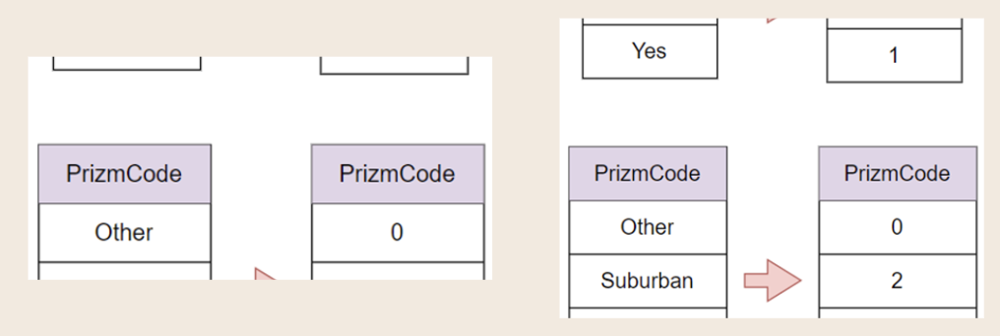

Developing an ensemble model that combines Convolutional Neural Networks (CNN) with other machine learning models helps address the big problem of high churn rates in the telecom industry. When customers leave, telecom companies lose a lot of revenue, and bringing in new customers or keeping existing ones can be expensive. By creating a model that predicts which customers are most likely to leave, telecom companies can take action to keep them. Traditional machine learning models sometimes miss complex patterns in customer data, so adding CNN to the model improves its ability to spot these patterns.

CNN is great at identifying detailed patterns in data, while machine learning models like Random Forests or Gradient Boosting are strong at making accurate predictions from structured data. By combining these two approaches, the ensemble model takes advantage of the strengths of both. This leads to better accuracy in predicting which customers are likely to churn. With this improved accuracy, telecom companies can focus on the customers most at risk of leaving and take steps to retain them, reducing the overall churn and saving costs.

**Project Flowchart**

**Dataset Description**
Cell2cell dataset consist of wide range of features, such as information on demographics, pattern of usage, subscription to service, call information, and account characteristic. There are 51, 047 instances and 58 attributes.

**EDA and Dataset Preprocessing**
Exploratory Data Analysis (EDA) is a important step in data pre-processing, as it helps gain insights and understanding of the dataset. Data pre-processing is crucial for model performance, as the quality of data directly impacts the model's accuracy and effectiveness. EDA can help in identifying the missing value, dropping the irrelevant variables, and data transformation to effectively pre-process the data.

**Missing value Handling**

- There are 14 features in total that contain missing values.
- The feature with missing value were imputed with value of 0.

**Remove Irrelevant Features**
- During EDA, "Customer ID" and "Service Area" features do not contribute meaningful insights.
- These features are dropped from the dataset as they are deemed irrelevant to the analysis.

**Data Transformation**

Label Encoding is used to transform categorical features into a numeric form suitable for modeling.

Min-max scaling, a common data scaling method, is used to scale features to a range of 0-1.

**Imbalance Class Handling**
Binary classification often faces class imbalance, with churners being the minority class which lead to bias model. The Cell2cell dataset also exhibits class imbalance, with a high percentage of non-churners. Synthetic Minority Oversampling Technique (SMOTE) is a relevant method for data balancing. SMOTE generates synthetic instances of the minority class to address class imbalance.

**Modelling**
- Ensemble learning combines multiple algorithms to improve predictions.
- Heterogeneous ensembles are recommended for customer churn prediction due to their ability to leverage different classifiers and enhance performance.
- Base Classifier: Logistic Regression, Decision Tree, Support Vector Machine, and Convolutional Neural Network
- CatBoost is chosen as the meta-learner for its effective handling of diverse data.

The final result is shown as above. The model get 62.4% of f1-score.

